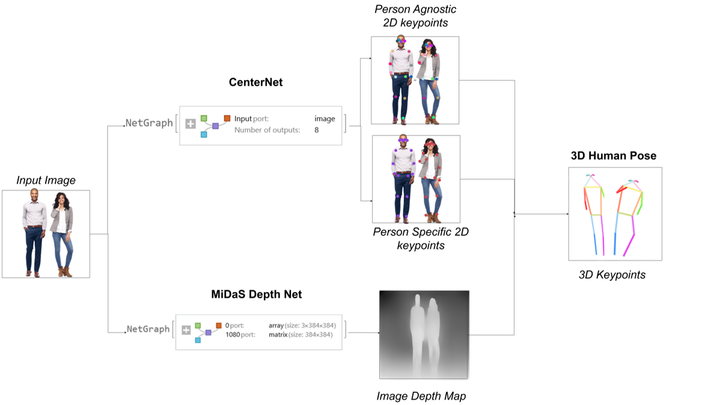
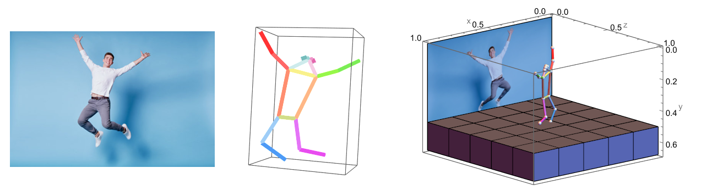

# WSS23 - 3D Human Pose Estimation

For Wolfram Summer School 2023, I worked on estimating 3D pose in form of human skeletons and 3D meshes from video and images using neural networks.

## Objective
This project aims to leverage advanced computer vision techniques to accurately estimate the 3D positions of 17 keypoints on the human body and create visually appealing visualizations of the estimated pose in a 3-dimensional display.

## Approach
This project implemented a two-step approach for 3D human pose estimation. The CenterNet model from the Wolfram Neural Network repository was employed to estimate the 2D coordinates of 17 keypoints on the human body. The MiDaS monocular depth estimation model was utilized by importing it using ONNX to obtain depth information. By combining the 2D coordinates with the estimated depths, the body joint linkages were established and the pose was visualized in 3D. We tested the pipeline on various single person images and videos, and it demonstrated comparable results and visualizations to state-of-the-art technologies.

## Future Directions:

1. Multi-person support: Extend the project to estimate 3D keypoints for multiple individuals in an image while maintaining their separation as distinct human skeletons.
2. Occlusion handling: Explore the development of an occlusion-resistant model capable of estimating keypoints even when body parts are partially hidden.
3. Video optimization: Investigate ways to enhance and implement the 3D estimation pipeline for video data.
4. Mesh Regression: Consider further work on converting 3D poses into a standard human mesh using the obtained 3D points.

## Gallery
Here are some interesting results on images.

More details can be found in this [Wolfram Community Post](https://community.wolfram.com/groups/-/m/t/2958416)
